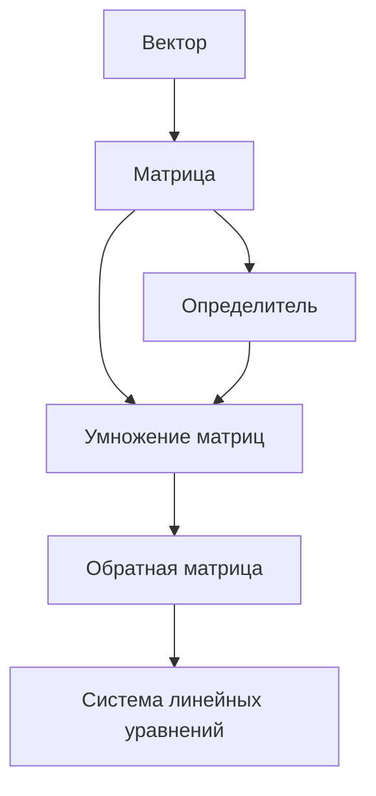

# Суть

**Визуальная схема**, показывающая, как понятия книги связаны между собой. Не оглавление (это просто список), а **граф связей**: что от чего зависит, что вытекает из чего, какие понятия играют роль «концентратора».

# Зачем

Книга — это **не цепочка глав**, а **сеть понятий**. Читателю важно видеть **карту территории** до того, как он по ней пошёл. Это снимает страх «потеряться».

# Когда применять

- В **начале книги** — общая карта всех понятий (даже если они ещё не введены).
- **Опционально** в начале крупных блоков (после первой части — карта блока 1).

# Технические требования

- **Узлы** = понятия (или главы).
- **Связи** = «зависит от» / «следует из» / «применяется в».
- **Цвет** или **толщина** узла — важность понятия.
- **Не больше 20-30 узлов** в одной карте. Больше — нечитаемо.

# Технология

В Markdown можно использовать **Mermaid** — текстовый формат для схем, который рендерится в большинстве просмотрщиков:

# Связка

`book_concept_map` (статическая, один раз) + `book_recurring_map` (расширяющаяся, несколько раз) — комбинация Savov и Blitzstein. См. отдельный паттерн.

# Сборщик

На этапе финальной сборки книги:
1. Из метаданных каждой главы извлекается список понятий и зависимостей.
2. Скрипт строит Mermaid-описание автоматически.
3. Mermaid рендерится в SVG.
4. SVG помещается в начало книги.
